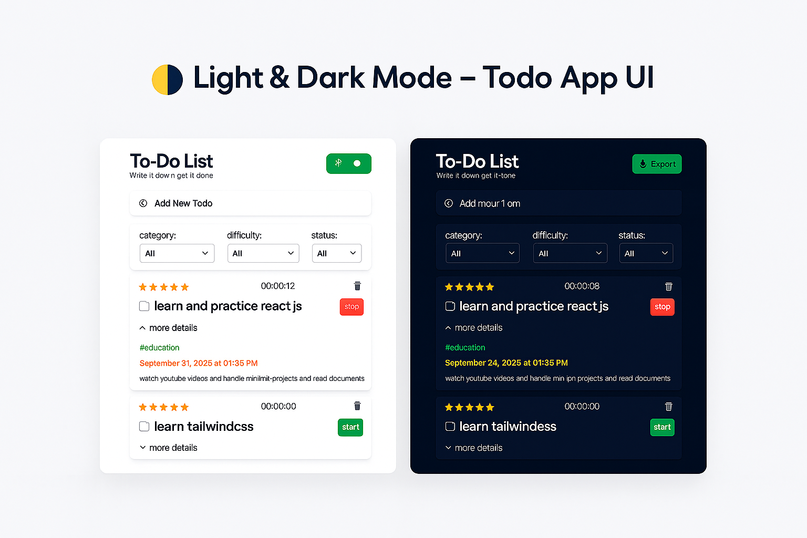

# 📝 Advanced Todo List  

A modern, responsive, and feature-rich **Todo List App** built with **HTML, TailwindCSS, and Vanilla JavaScript**.  
This project is designed not just for managing tasks, but also to demonstrate advanced frontend concepts such as state management, local storage, export features, and interactive UI components.  

---

## 📸 Preview



---

## 🔍 Demo  

- Try it yourself [Here](https://pooyaams.github.io/To-Do-List/)

---

## 🚀 Features  

- ✅ Create, edit, delete, and complete todos  
- 🌙 **Dark/Light mode** (stored in LocalStorage)  
- 💾 Todos saved in **LocalStorage** (persistent between sessions)  
- ⏱ Individual **timer for each todo** (start/stop functionality)  
- 📂 **Export todos** in multiple formats:
  - PDF (via **jsPDF**)  
  - CSV  
  - JSON  
- 🔍 **Filter system** by:
  - Category  
  - Difficulty level  
  - Status (completed/pending)  
- 📄 **Pagination** – todos displayed 5 at a time  
- 🔔 Beautiful **notifications** (via **Notyf**)  
- 💬 **Interactive alerts** (via **SweetAlert**)  
- ⏳ **Custom loader animation** on page load  
- 📱 Fully **responsive design** using **TailwindCSS**  

---

## 🛠 Tech Stack  

- **HTML5**  
- **TailwindCSS**  
- **JavaScript (ES6+)**  
- **Notyf** – toast notifications  
- **SweetAlert2** – elegant alerts  
- **jsPDF** – export todos as PDF  

---

## 📥 Installation & Usage  

1. Clone the repository:  
   ```bash
   git clone https://github.com/your-username/todo-list.git
   ```
2. Open the project folder:  
   ```bash
   cd todo-list
   ```
3. Simply open `index.html` in your browser.  

_No additional setup required – everything runs client-side._  

---

## 📜 License  

This project is licensed under the **[MIT License](./LICENSE)**.  
